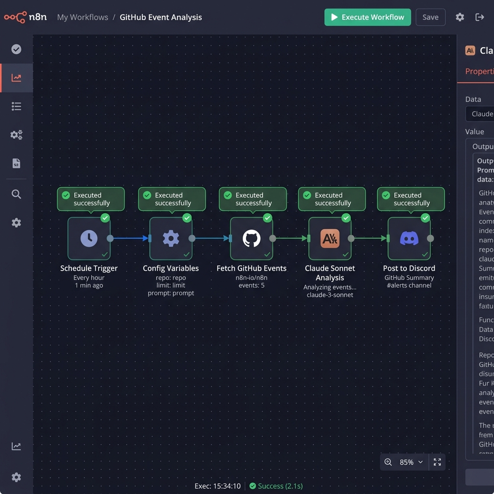

# Weekly Claude Dev Summary (n8n Workflow)

This n8n workflow runs every Friday at 5 PM, fetches the past week's GitHub activity for a specified repository, analyzes it using Anthropic's Claude 3.7 Sonnet, and delivers a beautifully written narrative summary to a Discord channel.

## Features
- **Configurable**: Easily set your target repo, output language (EN/FR), and Discord webhook inside the first Config node.
- **Automated**: Runs completely autonomously via a Schedule Trigger.
- **AI-Powered**: Uses Claude to digest raw GitHub JSON events into a readable narrative format.

## Setup Instructions

1. **Import the Workflow**: Open your n8n dashboard, click `Add workflow` -> `Import from File...` and select `workflow.json`.
2. **Configure Anthropic API**: Click the "Claude Sonnet Analysis" node. Under `Credentials`, add a new "Header Auth" credential named `Anthropic API Key`. Set Name to `x-api-key` and Value to your Anthropic API Key.
3. **Set Variables**: Open the "Config Variables" node and update:
   - `repo_owner` (e.g., `facebook`)
   - `repo_name` (e.g., `react`)
   - `language` (e.g., `EN` or `FR`)
   - `discord_webhook_url` (Your Discord webhook URL)
4. **Activate**: Toggle the workflow switch in the top right of n8n to "Active" to enable the Friday 5 PM cron.
5. **Test**: Click "Execute Workflow" at the bottom to run a manual test instantly.

## Proof of Execution

